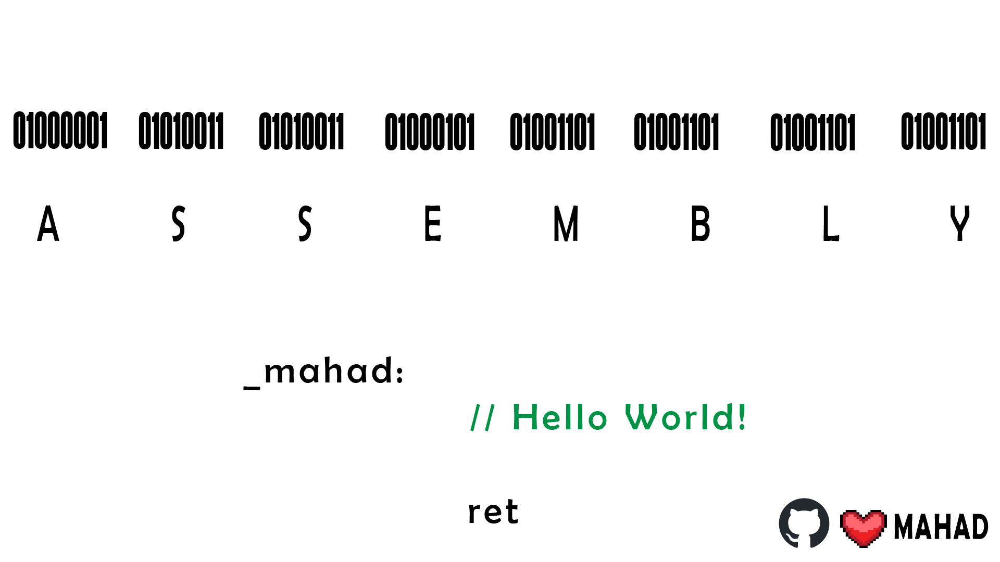

<p align="middle">
<a href="https://github.com/MahadMuhammad"></a>


-brightgreen.svg)
-brightgreen.svg)


# 🤔 Why Assembly?
- Why would anyone learn that language, which is hard to learn, write, debug & maintain.

- Why would anyone learn that language, which is different for different hardware & architecture.
- Why would anyone learn that language, which is not used in any modern programming language, operating system, compiler.

Great! You are reading this means that you are:
1.	Student being forced to learn assembly.

1.	Student who wants to learn assembly for [fun](https://youtu.be/9bZkp7q19f0?t=9).
1.	You are just exploring this stuff. 
1.	You have interest in learning assembly. 
1.	You want to become [hacker](https://en.wikipedia.org/wiki/Hacker_culture), [cracker](https://en.wikipedia.org/wiki/Cracker_(computing)), [computer scientist](https://en.wikipedia.org/wiki/Computer_scientist), [computer engineer](https://en.wikipedia.org/wiki/Computer_engineer), [computer architect](https://en.wikipedia.org/wiki/Computer_architect), [computer technician](https://en.wikipedia.org/wiki/Computer_technician).
### Drawbacks of Assembly:
1.	Assembly is hard to learn, read, understand, write, maintain, debug and explain to others.

1.	It is different for different hardware & [architecture](https://en.wikiversity.org/wiki/Assembly_language#Architecture). 
1.	For speed & efficiency, we use better algorithms & improved [compiler technology](https://learn.microsoft.com/en-us/archive/msdn-magazine/2015/february/compilers-what-every-programmer-should-know-about-compiler-optimizations). 
### Benefits of Assembly:
But on the other side, assembly language gives you more speed, space, capability and knowledge of your hardware. That the reason why [GOAT](https://en.wikipedia.org/wiki/Greatest_of_All_Time) programmer [Chris Sawyer](https://en.wikipedia.org/wiki/Chris_Sawyer) able to run such resource intensive game [RollerCoaster Tycoon](http://www.chrissawyergames.com/feature5.htm) on an [old processors](https://en.wikipedia.org/wiki/Pentium). So, the benefits are:

1.	You will understand how computers work.

1.	You wlll understand how [operating system](https://en.wikipedia.org/wiki/Operating_system), [CPU](https://en.wikipedia.org/wiki/Central_processing_unit), [memory](https://en.wikipedia.org/wiki/Memory_(computing)), [cache](https://en.wikipedia.org/wiki/Cache_(computing)), [register](https://en.wikipedia.org/wiki/Processor_register), [instruction](https://en.wikipedia.org/wiki/Instruction_set) works.
1.	You will understand the [computer architecture](https://en.wikipedia.org/wiki/Computer_architecture).
1.	You want to write efficient code.
1.	You want complete control of your computer.
1.	You love binary (you are not [human](http://www.captcha.net/images/recaptcha-example.gif)).


---
# 🌏 Contributors:
This repository would not be possible without the help of the following people:
- [Mohammad Nauman](https://github.com/recluze)

- [Haris Muneer](https://github.com/harismuneer)

---
# 🤑Resources:

####  Here are some resources that you can use to learn assembly language:

- [assembly-lang-course](https://github.com/recluze/assembly-lang-course)

- [BelalHashmi-Assembly-Exercise-Solutions](https://github.com/harismuneer/BelalHashmi-Assembly-Exercise-Solutions)
- [Bit-Manipulation-and-Subroutines-8086_Assembly](https://github.com/harismuneer/Bit-Manipulation-and-Subroutines-8086_Assembly)
- [Graphical-Display-Memory-and-Software_Hardware-Interrupts-x86_Assembly](https://github.com/harismuneer/Graphical-Display-Memory-and-Software_Hardware-Interrupts-x86_Assembly)
- [Stop-Watch_x86-Assembly](https://github.com/harismuneer/Stop-Watch_x86-Assembly)


#### If you want to write assembly language for [x86](https://en.wikipedia.org/wiki/X86) architecture, you can use the following assemblers:

 The offical/notes documentation of [x86](https://en.wikipedia.org/wiki/X86) assembly language is available [here](https://www.felixcloutier.com/x86/).
- [TASM](https://en.wikipedia.org/wiki/Turbo_Assembler) (Turbo Assembler)

- [MASM](https://en.wikipedia.org/wiki/Microsoft_Macro_Assembler) (Microsoft Macro Assembler)
- [FASM](https://flatassembler.net/) (Flat Assembler)
- [GAS](https://en.wikipedia.org/wiki/GNU_Assembler) (GNU Assembler)
- [NASM](https://www.nasm.us/) (Netwide Assembler)
- [YASM](http://yasm.tortall.net/) (Yet Another [x86](https://en.wikipedia.org/wiki/X86) Assembler)

#### If you want to write assembly language for [MIPS](https://en.wikipedia.org/wiki/MIPS_architecture) architecture, you can use the following assemblers:
 - The offical/notes documentation of [MIPS](https://en.wikipedia.org/wiki/MIPS_architecture) assembly language is available [here](https://www.mips.com/develop/tools/).

- [MARS](http://courses.missouristate.edu/KenVollmar/MARS/) (MIPS Assembler and Runtime Simulator)
- [QtSpim](http://spimsimulator.sourceforge.net/) (QtSpim is a graphical user interface for the [MIPS](https://en.wikipedia.org/wiki/MIPS_architecture) [R2000](https://en.wikipedia.org/wiki/R2000) simulator [SPIM](http://spimsimulator.sourceforge.net/).)
- [SPIM](http://spimsimulator.sourceforge.net/) (SPIM is a [MIPS](https://en.wikipedia.org/wiki/MIPS_architecture)32 simulator written in C by [John E. Stone](https://en.wikipedia.org/wiki/John_E._Stone).)
- [QtMips](http://qtmips.sourceforge.net/) (QtMips is a graphical user interface for the [MIPS](https://en.wikipedia.org/wiki/MIPS_architecture) [R2000](https://en.wikipedia.org/wiki/R2000) simulator [SPIM](http://spimsimulator.sourceforge.net/).)

#### If you want to write assembly language for [ARM](https://en.wikipedia.org/wiki/ARM_architecture) architecture, you can use the following assemblers:
 - The offical documentation of [ARM](https://en.wikipedia.org/wiki/ARM_architecture) assembly language is available [here](https://developer.arm.com/documentation/).

- [ARMKeil](https://www.keil.com/) (Keil is a [software development environment](https://en.wikipedia.org/wiki/Software_development_environment) for [embedded](https://en.wikipedia.org/wiki/Embedded_system) software development.)
- [ARM](https://en.wikipedia.org/wiki/ARM_architecture) [GCC](https://gcc.gnu.org/) (The [GNU](https://www.gnu.org/) [Compiler](https://gcc.gnu.org/) [Collection](https://gcc.gnu.org/) includes front ends for [C](https://en.wikipedia.org/wiki/C_(programming_language)), [C++](https://en.wikipedia.org/wiki/C%2B%2B), [Objective-C](https://en.wikipedia.org/wiki/Objective-C), [Fortran](https://en.wikipedia.org/wiki/Fortran), [Ada](https://en.wikipedia.org/wiki/Ada_(programming_language)), [Go](https://en.wikipedia.org/wiki/Go_(programming_language)), and [D](https://en.wikipedia.org/wiki/D_(programming_language)), as well as libraries for these languages (libstdc++, [libgcj](https://gcc.gnu.org/onlinedocs/libgcj/), [libobjc](https://gcc.gnu.org/onlinedocs/libobjc/), [libgfortran](https://gcc.gnu.org/onlinedocs/libgfortran/), [libgo](https://gcc.gnu.org/onlinedocs/libgo/), [libada](https://gcc.gnu.org/onlinedocs/libada/), [libffi](https://gcc.gnu.org/onlinedocs/libffi/), and [libjava](https://gcc.gnu.org/onlinedocs/libjava/))).
- [ARM DS-5](https://developer.arm.com/tools-and-software/embedded/arm-development-studio) (ARM Development Studio is a [software development environment](https://en.wikipedia.org/wiki/Software_development_environment) for [embedded](https://en.wikipedia.org/wiki/Embedded_system) software development.)


#### If you want to write assembly language for [RISC-V](https://en.wikipedia.org/wiki/RISC-V) architecture, you can use the following assemblers:
    
- The offical documentation of [RISC-V](https://en.wikipedia.org/wiki/RISC-V) assembly language is available [here](https://riscv.org/wp-content/uploads/2017/05/riscv-spec-v2.2.pdf).

#### If you want to write assembly language for [8088](https://en.wikipedia.org/wiki/Intel_8088) architecture

- Then you can use [8088](https://en.wikipedia.org/wiki/Intel_8088) assembly language. The offical documentation of [8088](https://en.wikipedia.org/wiki/Intel_8088) assembly language is available [here](https://www.cs.virginia.edu/~evans/cs216/guides/x86.html).

#### If you want to write assembly language for [Apple ARM architecture](https://www.apple.com/newsroom/2020/11/apple-unleashes-m1/)

- The official documentation of ARM architecture is available [here](https://developer.arm.com/documentation).

- Then you can use Apple ARM assembly language. The offical documentation of Apple ARM assembly language is available [here](https://developer.apple.com/documentation/xcode/writing-arm64-code-for-apple-platforms).
- There is cool GitHub repository for Apple ARM assembly language. The GitHub repository is available [here](https://github.com/below/HelloSilicon).
---

# 📺 8088 Assembly Language Video Tutorials:

- Belal Hashmi video lectures available [here](https://www.youtube.com/playlist?list=PLKyB9RYzaFRh9pYhDsTGXnDqRx0YZQFbn).

- Video lectures of [Mohammad Nauman](https://github.com/recluze) availabe [here](https://youtube.com/playlist?list=PLnd7R4Mcw3rJCvAduQxyySvejtBIaPs0O).
- Video lectures by Malik Shahzaib available [here](https://youtube.com/playlist?list=PLAZj-jE2acZLdYT7HLFgNph190z2cjmAG).


---
<!-- <iframe src="https://drive.google.com/file/d/1MOidFawmpqAbZCAJlRwPkpCNTRed6Hgf/view" width="640" height="480"></iframe> 


---

[](https://www.youtube.com/playlist?list=PLKyB9RYzaFRh9pYhDsTGXnDqRx0YZQFbn "Everything Is AWESOME") -->

[](https://www.youtube.com/playlist?list=PLKyB9RYzaFRh9pYhDsTGXnDqRx0YZQFbn "Click me to view: PlayList of video lectures by Belal hasmi")

## 📚 Book for 8088 Assembly Language:

1. **Handbook** of Belal Hashmi available [here](https://drive.google.com/file/d/1NYdo4t-VM1D8cc_QH5NnkwxtMPFVBoRu/view?usp=sharing).
1. [**Assembly Language for x86 Processors**](http://www.asmirvine.com/) by Kip R. Irvine.
1. **Assembly language step by step** by Jeff Duntemann.
1. **Computer organization and Architecture** by William Stallings.
---
# 🛠️ Setup and Installation of [8088](https://en.wikipedia.org/wiki/Intel_8088) Assembler and Simulator:

> The procedure is same for major operating systems like `Windows`, `Linux`, `MacOS`, etc.
- Download the DOSBOX from the following link:

    - [DOSBOX](https://www.dosbox.com/download.php?main=1)

    - On debian based linux distributions like `ubuntu`, you can install the `DOSBOX` using the following command:
        ```bash
        sudo apt install dosbox
        ```

        - Or, you can install the fork of `DOSBOX` project `DOSBox-X`, (which was mainatined by [Snapcrafters community](https://snapcraft.io/publisher/snapcrafters)) using the following command:
            ```bash
            sudo apt install dosbox-x
            ```

    - If you are on `Windows`, then you can install the `DOSBOX` using the following command from `PowerShell` or `Command Prompt` as `Administrator` using [Chocolatey](https://chocolatey.org/) package manager:
        ```bash
        choco install dosbox
        ```
        - Or you can use [winget-cli](https://github.com/microsoft/winget-cli) package manager:
            ```bash
            winget install -e --id DOSBox.DOSBox
            ```

    - If you are on `MacOS`, then you can install the `DOSBOX` using the following command from `Terminal` using [Homebrew](https://brew.sh/) ( free and open-source software package management system for macOS and Linux):
        ```bash
        brew install dosbox
        ```
#### Then you can use the following procedure to use the [8088](https://en.wikipedia.org/wiki/Intel_8088) Assembler and Simulator:

1. [8088](https://en.wikipedia.org/wiki/Intel_8088) Assembler and Simulator is available [here](https://drive.google.com/file/d/16rATc7y1x0Xw1V6MEip7waSMP316dxmy/view?usp=sharing).

1. Otherwise, If you have `git` installed, then you can clone the repository using the following command:
    ```bash
    git clone https://github.com/MahadMuhammad/Learn-Assembly-The-Hard-Way.git
    ```
1. Or, you can download the zip file from the GitHub repository main page.
1. Extract the zip file.
1. Open the extracted folder.
1. Open the `folder`.
1. Open the `8088 Assembler and Simulator` folder.
1. Now, you can use the [8088](https://en.wikipedia.org/wiki/Intel_8088) Assembler and Simulator `DOSBOX`.
---
# 💭 Logic Building and Problem Solving with Assembly Language:
### Common Mistakes:
- Many people start writing code without thinking about the logic.

- They just start writing code.
- My **advice** is that you should first think about the logic on **paper**, make an **algorithm** and then start writing code. 
### Logic Building:
- If you are completely **stuck** on a problem and didn't think about the logic, then first write the code in the high level language like `Python` or `C/C++` and then convert it into assembly language.

- If you are unable to convert that `high level langauge` code into `assembly language` code, then use the [compiler explorer](https://godbolt.org/z/6oaTnh8nz) to convert it into assembly language code.
### Resolving Errors:
- If you get an unkown error, then first try to understand that error.
- Use assembly language debugger to debug your code.

- Debug your code `line by line`.
- If this doesn't work, then try taking help from your friends, seniors, teachers, etc. 
- Also if you are good at this then try helping your friends, juniors in solving their problems.
---
# 💖 Sponsorship:
- Currently, we are not accepting any sponsership. But, if you want to sponsor this project, then you can contact us at [Mahad](https://github.com/MahadMuhammad/).

- Just pray for us and my contributors. And, we will be thankful to you.
---
# 📜 License:
- This project is licensed under the [MIT License](https://github.com/MahadMuhammad/Learn-Assembly-The-Hard-Way/blob/main/LICENSE)

---

